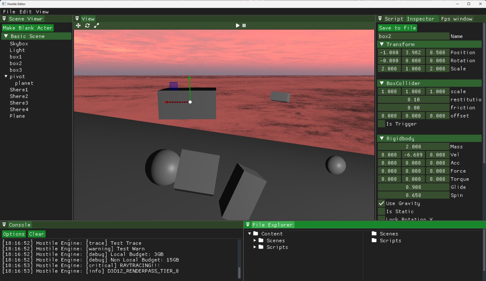
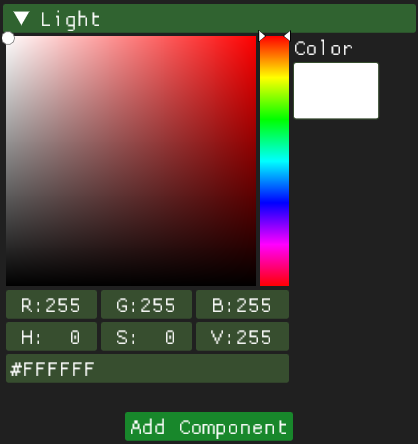
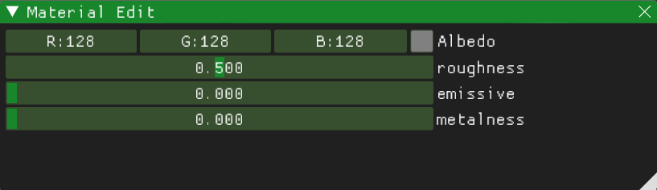
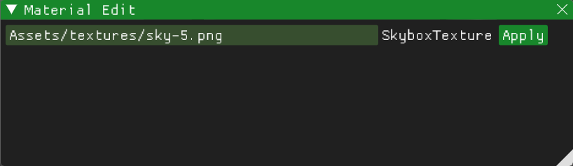

# Hostile Engine
**Contents**  
[1. Info](#info)  
[2. Goal](#goal)  
[3. Results](#results)  
[4. What I Did](#what-i-did)  
[5. What I Would Do Differently](#what-i-would-do-differently)  
[6. What I Learned](#what-i-learned)  
[7. Pictures](#pictures)  
[8. Links](#links)
## Info
**Date:** Fall 2023 - Spring 2024  
**Class:** GAM 400/450 (Senior Game Project Class)  
**Where:** DigiPen Institute of Technology  
  
**This Document is an overview of my contributions to this project**  
  
**Team Composition:**  
**Total Members:** 5  
**My Roles:** Graphics Programmer, General Engine Programmer  
## Goal
The goal with Hostile Engine was to learn how game engines work by making a simple but powerful game engine in the same vein as Unity. We planned to have a fully functional editor with the ability to save and load scenes and eventually compile and export those scenes as games.
## Results
In the end we did manage to make a simple editor that allowed you to create entities and save them as scenes. As well as a scripting engine that could be edited and reloaded at will, DirectX12 based graphics, and 3D physics. We did not manage to implement the ability to export your build as a game.
## What I Did
Most of my contribution was in the Graphics Engine, which I implemented using DirectX12. It allowed for simple meshes, Physically Based Rendering, and Image Based Lighting. It also supported multiple materials that took in variable inputs that could be changed and edited in the editor. Unfortunately while I did implement 3D skeleton based animation, it did not make it into the editor.  
I also assisted in much of the core engine development, including the ECS architecture and design of systems.
## What I Would Do Differently  
For one thing I would have spent more time working on the engine in the second semeseter. I would also have spent more time planning how the systems would work ahead of time. Finally I would have spent more time on performance.
## What I Learned
I learned a lot about how game engines are made and some of the unseen complexities that come with having multiple complex systems that have to interact with one another. 
## Pictures
### General Editor View:  
  
### Light Component Editor View:  
  
### Material Editor For Default Material:  
  
### Material Editor For Skybox Material:  

## Links
[Hostile Engine](https://github.com/Environmental-Corporate-Solutions/Hostile-Engine)  
[Portfolio](https://github.com/sam-biks/Portfolio)